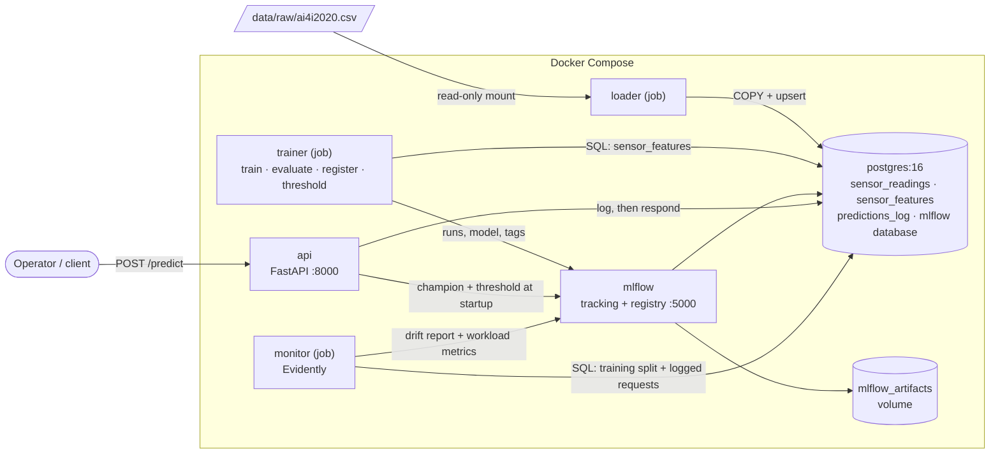

# AI4I Predictive Maintenance: recommendations for a human operator

[](https://github.com/DevrathBrahme/MLOps-AI4I-Predictive-Maintenance/actions/workflows/ci.yml)
[](LICENSE)

A multi-class failure-mode classifier for milling machines, built on the
[AI4I 2020 Predictive Maintenance Dataset](https://archive.ics.uci.edu/dataset/601/ai4i+2020+predictive+maintenance+dataset)
and wrapped in a production-style MLOps stack: PostgreSQL queried with SQL, MLflow tracking
and model registry, a FastAPI service, Evidently drift monitoring, Docker Compose, a layered
pytest suite and GitHub Actions.

**The model informs; a person decides.** The API never triggers an action. For each sensor
reading it returns a *flagged recommendation*: a risk tier, the most likely failure mode, the
runner-up mode and an uncalibrated confidence score, for a human operator to review. Every
recommendation is written to Postgres before it is returned.

> **This page is the short version.** The [technical report](docs/technical-report.md) has
> every result, decision and check in full.

---

## Results at a glance

| | |
|---|---|
| **Data** | 10,000 readings loaded into Postgres once; features, labels, training, serving and monitoring all read it with SQL |
| **Model** | XGBoost over 5 classes, chosen by a rule fixed before any per-class result was seen. Sealed test set used once: macro-F1 **0.806** (cross-validation predicted 0.789 ± 0.014) |
| **The honest weak spot** | Tool-wear failure (TWF). The champion ranks TWF risk well (out-of-fold ROC-AUC 0.95) but makes it the top class for only 4 of 37 out-of-fold TWF rows |
| **Turning ranking into review** | An *elevated* review tier, capped at 2% of healthy rows, raises flagged TWF rows from **5 to 13 of 37** |
| **API** | Returns a recommendation and has no field that could express an action; an unlogged recommendation can't reach an operator |
| **Monitoring** | A simulated +2 K air-sensor fault was flagged in exactly the two affected columns, and the operator's review load rose to **2.4×** the design level. The expected numbers were committed before the run |
| **Reproducibility** | Every push rebuilds the system on an empty CI machine: the new model must reproduce the registered champion, and the drift scenario must reproduce its committed numbers |

**Stack:** Python 3.12 · pandas · scikit-learn · XGBoost · PostgreSQL + SQL · MLflow · FastAPI ·
Evidently · Docker + Compose · pytest · GitHub Actions
([where each one is used](docs/technical-report.md#contents)).

---

## Why a person decides

- **Three failure modes are deterministic in this dataset.** Heat dissipation (HDF), power
  (PWF) and overstrain (OSF) failures are reproduced exactly by published physics rules on the
  engineered features: **0 disagreements across all 10,000 rows**. Near-perfect scores on these
  classes reflect how the synthetic data was made, not model brilliance.
- **Tool-wear failure is genuinely uncertain.** 790 readings have a tool wear of 200–240 min,
  and only 43 of them are tool-wear failures. An automatic stop in that window would halt about
  17 healthy tools for every one that would actually fail.
- **The second choice carries real signal.** When XGBoost misclassified a real failure out of
  fold, the true mode was its **second** choice in 35 of 41 cases (85%). So the API returns the
  runner-up too.
- **Errors cost different amounts, and so does workload.** A missed failure costs downtime; a
  false alarm costs a review, but too many cause alarm fatigue. Recall is favoured within an
  explicit, pre-registered review budget.

---

## Architecture



**Services:**
- **Always running:** `postgres`, `mlflow` and `api`. MLflow and the API have no
  authentication, so both are published on `127.0.0.1` only.
- **Jobs, run on demand:** `loader`, `trainer` and `monitor` run with `docker compose run`.
  The loader is the **only** container that mounts the CSV.

**One Dockerfile, two images:**
- The runtime image runs the API, the MLflow server, the loader and the trainer.
- The monitor image adds Evidently, so its 44 extra packages never enter the API image.
- Both run as a non-root user, and an allowlisted build context keeps the CSV, `.env` and
  artifacts out of every image.

**Startup and health:**
- The API's health means "can log a recommendation right now". It recovers on its own when
  Postgres comes back.
- If no champion model can be loaded at startup, the API exits instead of serving without one.

---

## Data and physics-informed features

**Postgres is the source of truth:**
- **Loading:** the loader validates the CSV against an explicit contract, then loads it in one
  transaction (`COPY` into a staging table, then an upsert). Rerunning it changes 0 rows.
- **Labels are defined in SQL**, in the `sensor_features` view, after an audit of the failure
  flags found 51 contradictory or ambiguous rows (details in the
  [report](docs/technical-report.md#3-data-in-postgres-queried-with-sql)).
- **Everything downstream reads Postgres:** training, serving and monitoring all query it.

| Feature | Formula | Unit | Physical meaning |
|---|---|---|---|
| `power_w` | `torque_nm × rotational_speed_rpm × 2π / 60` | W | mechanical power (rpm converted to rad/s) |
| `temp_diff_k` | `process_temp_k − air_temp_k` | K | how much heat the process can shed to the air |
| `strain_min_nm` | `tool_wear_min × torque_nm` | min·N·m | accumulated load on a worn tool |

The features reproduce the dataset's failure rules exactly, which is why HDF, PWF and OSF are
easy and TWF is not:

| Mode | Rule on the engineered features | Disagreements (10,000 rows) |
|---|---|---|
| HDF | `temp_diff_k < 8.6` and rpm `< 1380` | **0** |
| PWF | `power_w < 3500` or `> 9000` | **0** |
| OSF | `strain_min_nm` > 11,000 / 12,000 / 13,000 for type L / M / H | **0** |

Training reads the features from the SQL view; the API computes them in Python. A test checks
the two are **bit-identical on all 10,000 rows**, because a reading can sit exactly on a rule
threshold.

---

## Model and evaluation

Always predicting `no_failure` scores 96.7% accuracy and catches nothing, so models are judged
on per-class precision, recall and F1, confusion matrices and ROC-AUC, with macro-F1 as the
summary.

**The approach:**
- **Model:** a scikit-learn `Pipeline` (ordinal-encoded product type plus 8 numeric features),
  with Random Forest and XGBoost as candidates.
- **Imbalance:** balanced sample weights, no SMOTE, because synthetic rows could land on the
  wrong side of the dataset's exact physical thresholds.
- **Comparison:** a stratified 80/20 holdout, then 5-fold cross-validation and out-of-fold
  predictions **on the training split only**. The test split stays sealed.

**The champion was chosen by a rule written before any per-class result was seen.** A
criterion decides only if the gap between the models exceeds the fold-to-fold noise:

| # | Criterion | RF | XGBoost | Noise | Decides? |
|---|---|---:|---:|---:|---|
| 1 | TWF recall (out of fold) | 0.135 | 0.108 | 0.107 | tie |
| 2 | False alarms (of 7,728 healthy rows) | 56 | 43 | ≈ 17 rows | tie |
| 3 | TWF ROC-AUC | 0.950 | 0.948 | 0.027 | tie |
| 4 | Model size on disk | 12 MB | 1.8 MB | — | **XGBoost** |

The models are indistinguishable on everything an operator cares about, so the tie-breaker,
serving footprint, decided. XGBoost is not claimed to be "better".

**The sealed test set was used once.** Evaluation refuses to run twice and checks a fingerprint
of the test rows first. The expected band, written down beforehand, was macro-F1 0.76–0.82.

| Class | Precision | Recall | F1 | ROC-AUC | Support |
|---|---:|---:|---:|---:|---:|
| no_failure | 0.996 | 0.996 | 0.996 | 0.994 | 1,933 |
| TWF | 0.167 | 0.111 | 0.133 | 0.966 | 9 |
| HDF | 0.913 | 1.000 | 0.955 | 1.000 | 21 |
| PWF | 0.950 | 1.000 | 0.974 | 1.000 | 19 |
| OSF | 1.000 | 0.941 | 0.970 | 1.000 | 17 |

The results:
- **Macro-F1 0.806**, inside the band.
- **TWF recall 1 of 9**, consistent with out of fold.
- **7 false alarms** on 1,933 healthy rows.

Out-of-fold tables, confusion matrices and the error analysis (every mistake traced to its
Postgres row) are in the [report](docs/technical-report.md#5-training-imbalance-and-evaluation).

---

## The review tiers

| Tier | Rule | Meaning for the operator |
|---|---|---|
| **high** | the most probable class is a failure mode | review now |
| **elevated** | the most probable class is `no_failure`, but `confidence_score = 1 − P(no_failure) > t` | please inspect |
| **low** | everything else | no review suggested |

**How `t` was chosen.** `t` is the lowest threshold that flags at most **2% of healthy training
rows**, computed on out-of-fold probabilities, with the 2% budget committed to git before the
threshold was computed. The result, `t = 0.0626075267791748`, is stored on the registered
model version and on every log row.

| Tier (out of fold) | Rows | Real failures | Hit rate |
|---|---:|---:|---:|
| high | 271 | 228 | 84.1% |
| elevated | 120 | 9 | 7.5% |
| low | 7,601 | 27 | 0.36% |

What the tiers buy, and what they can't:
- **More TWF caught:** the elevated tier raises flagged TWF rows from **5 to 13 of 37**, at a
  cost of 111 extra healthy reviews.
- **Elevated means inspect, not stop:** about 1 in 13 elevated flags is a real failure, so
  *elevated* means "please inspect", never "stop the machine".
- **The confidence score is a ranking, not a probability.** It isn't calibrated; the hit rates
  above are the honest frequencies.


---

## The recommendation API

`GET /health` and `POST /predict`, nothing else. A request carries the 6 raw sensor readings.
Unknown fields are rejected, including any attempt to send an `action`, and types are strict.

**The response is a recommendation with 13 fields and deliberately no action field:**

| Field | Meaning |
|---|---|
| `request_id`, `created_at` | id and timestamp of the `predictions_log` row, assigned by Postgres |
| `model_name`, `model_version` | the registered version that scored this reading |
| `flagged`, `risk_tier` | whether an operator should review, and how urgently |
| `confidence_score` | `1 − P(no_failure)`, an uncalibrated ranking score |
| `predicted_mode`, `predicted_probability` | the most probable class |
| `runner_up_mode`, `runner_up_probability` | the second most probable class |
| `class_probabilities` | all five class probabilities |
| `physics_features` | the three computed features, to check against known limits |

**Log, then respond.** The API scores the reading, assigns the tier and inserts the full
recommendation into `predictions_log`. Only then does it return the response, carrying the
inserted row's id and timestamp. An unlogged recommendation can't reach an operator: if
Postgres is unreachable, the API returns **503 and no recommendation**.

**The tier rule is enforced in three places:** in the code that computes it, in the response
schema, and in a Postgres CHECK constraint that recomputes it from the stored row. A bug in one
of them fails loudly instead of showing an operator a wrong tier.

The schema says the same in the API's own documentation (`/docs`), with additional properties
forbidden at every level:

<p>
  
  
</p>

---

## Drift and workload monitoring

`python -m ai4i.monitor --since <timestamp>` compares every request logged since a cutoff with
the training split, and records the result as one MLflow run.

**What it checks:**
- **Inputs:** Evidently compares each of the 9 model inputs with its defaults (normed
  Wasserstein, Jensen–Shannon).
- **The rule:** alert if **any** column drifts. Evidently's default dataset rule needs half the
  columns to drift, and a real two-column sensor fault would pass it.
- **Window size:** fewer than 1,000 requests gets `insufficient_data`, never "no drift".
  Measured on healthy data, smaller windows raised false alarms up to 99.5% of the time.
- **Workload:** labels don't exist in production, so the operator-facing signal is the flagged
  share, from SQL, against what the champion flagged out of fold (4.89%).

**The scenario: an air-temperature sensor reading 2 K high.** The 1,999 sealed test readings
were replayed through the live API, first as recorded and then with the air sensor offset. The
expected outcome was **committed to git before the run**.

| Window | flagged | vs design load | HDF predicted | drifted columns (score) | verdict |
|---|---:|---:|---:|---|---|
| as recorded | 5.20% | 1.06× | 23 | none (max 0.035) | `no_drift` |
| air sensor +2 K | **11.66%** | **2.38×** | **147** | `air_temp_k` (1.006), `temp_diff_k` (2.001) | `drift` |

What happened:
- **Exactly the right columns:** only the two affected columns drift.
- **The physics feature shows the fault twice as strongly,** because its spread is half the air
  temperature's.
- **The model's reaction:** it reads the lower temperature difference as poor heat dissipation,
  and the review load reaches 2.4× the design level. Every extra flag is caused by the sensor,
  not the machines.
- **Why a person in the loop matters here:** because the system recommends rather than acts,
  that's about 130 extra reviews instead of about 130 stopped machines. The drift report points
  the reviewer at the air sensor.
- **It reproduced exactly:** bit for bit on a laptop, and again in CI on every push.


The full design, the window-size measurement and the safety guard are in the
[report](docs/technical-report.md#8-drift-and-workload-monitoring-with-evidently).

---

## Testing and CI/CD

**Five test layers:**

| Layer | What it proves |
|---|---|
| unit | metrics, tiers, features and the drift rule against hand-computed or independent values |
| contract | request validation, no action field anywhere in the response, tier consistency |
| api | log-then-respond, 422/503/500 paths, with a stub model and a fake database |
| registry | the sealed-test guard and idempotent registration, on private MLflow stores |
| integration | SQL and Python features bit-identical; every database constraint; the monitoring SQL |

**Each layer was validated by breaking the code on purpose.** One example: a "harmless"
rewrite of the rpm conversion passed the unit tests but failed the parity test on 3,145 of
10,000 rows, differing only in the last bit.

**Three CI jobs on every push and pull request:**

| Job | What it proves |
|---|---|
| Tests (no services) | the package works on a clean machine |
| Integration tests (Postgres) | the database built from this repository behaves as the code expects |
| Bootstrap smoke (full stack) | rebuilt from empty: the new model reproduces the registered champion; the API logs before it responds; the drift scenario reproduces; the model records its commit |

The smoke job runs only after both test jobs pass. To prove CI can fail, a throwaway pull
request ([#1](https://github.com/DevrathBrahme/MLOps-AI4I-Predictive-Maintenance/pull/1))
broke the rpm conversion: both test jobs failed on exactly the expected test, and the smoke job
never started.

Details: [testing](docs/technical-report.md#9-testing) and [CI](docs/technical-report.md#10-cicd).

---

## MLflow run history


Only XGBoost carries sealed-test metrics, and only XGBoost is registered (`champion` → version
1). The model, its evaluation and its threshold can be rebuilt from this repository; CI does it
on every push. The original run records live in Docker volumes and can't be, which is why they
are shown here.

---

## Run it yourself

Requires Docker Engine with Compose v2. These commands rebuild everything from an empty
database, exactly as the CI smoke job does.

```bash
cp .env.example .env                       # then set POSTGRES_PASSWORD
docker compose --profile jobs build        # runtime and monitor images
docker compose up -d --wait postgres mlflow
docker compose run --rm loader             # CSV -> Postgres (the only step that reads the CSV)
docker compose run --rm trainer python -m ai4i.train --model xgb
RUN_ID=$(docker compose run --rm -T trainer python -c "import mlflow; print(mlflow.search_runs(experiment_names=['ai4i-failure-classifier'])['run_id'].iloc[0])" | tail -n1)
docker compose run --rm trainer python -m ai4i.evaluate --run-id "$RUN_ID"   # sealed test set, used once
docker compose run --rm trainer python -m ai4i.registry --run-id "$RUN_ID"   # version 1, alias champion
docker compose run --rm trainer python -m ai4i.thresholds --model xgb        # review-tier threshold tags
docker compose up -d --wait api
```

- **API docs:** http://localhost:8000/docs
- **MLflow UI:** http://localhost:5000 (switch to **Model training** mode).
- **Monitoring and the drift scenario:** see the
  [report](docs/technical-report.md#12-run-it-yourself).

**Tests** (Python 3.12):

```bash
python -m venv .venv && source .venv/bin/activate
python -m pip install -r requirements-dev.txt && python -m pip install -e .
python -m pytest -m "not integration"     # no services needed
set -a; source .env; set +a
python -m pytest                          # everything; needs the stack above, with the data loaded
```

---

## Limitations

- **Synthetic, partly deterministic labels:** results on HDF, PWF and OSF overstate what to
  expect on real machines.
- **Small rare classes:** only 37 TWF rows for training and 9 for testing.
- **`confidence_score` is uncalibrated:** quote the per-tier hit rates as frequencies.
- **Monitoring measures inputs and workload, not accuracy:** no labels arrive in production.
  It also assumes random-order windows, because AI4I's temperatures drift in row order.
- **Local-development deployment:** there is no authentication, and the MLflow run history
  can't be rebuilt from the repository.

The [full list](docs/technical-report.md#14-limitations) is in the report.

---

## License

[MIT](LICENSE) © 2026 Devrath Brahme
