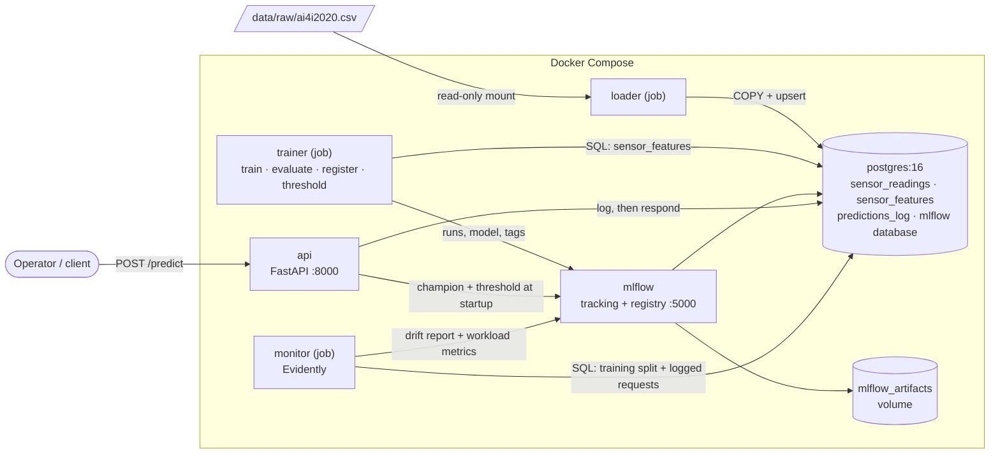
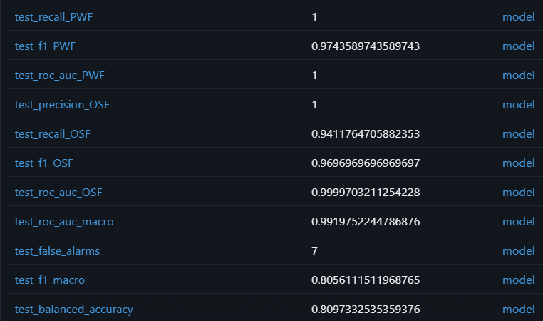
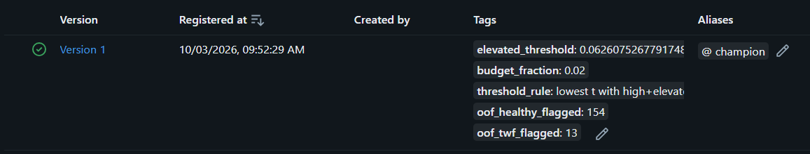
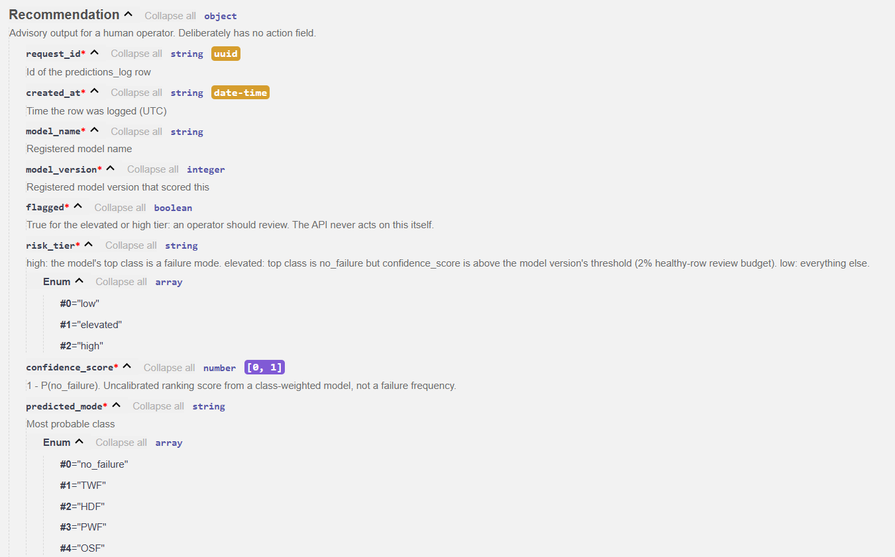
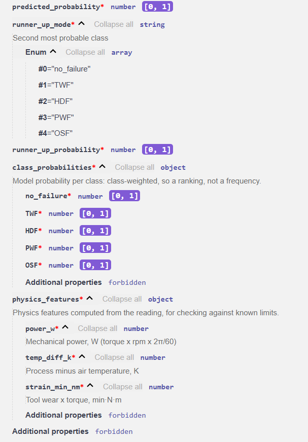
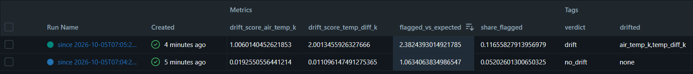
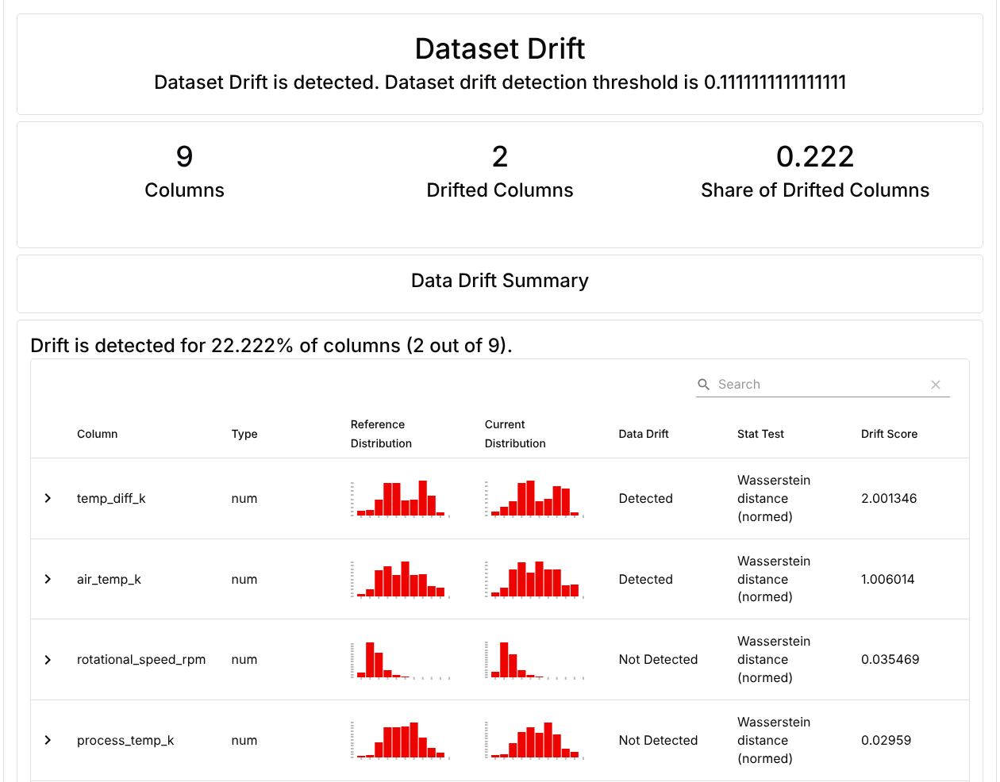
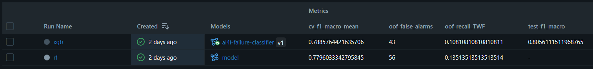

# AI4I Predictive Maintenance: technical report

> The full write-up behind the project's [README](../README.md): every result, decision and check, with the evidence.
> The README is the short version.

[](https://github.com/DevrathBrahme/MLOps-AI4I-Predictive-Maintenance/actions/workflows/ci.yml)
[](../LICENSE)

A multi-class failure-mode classifier for milling machines, built on the
[AI4I 2020 Predictive Maintenance Dataset](https://archive.ics.uci.edu/dataset/601/ai4i+2020+predictive+maintenance+dataset)
and wrapped in a production-style MLOps stack: PostgreSQL queried with SQL, MLflow tracking
and model registry, a FastAPI service, Evidently drift monitoring, Docker Compose, a layered
pytest suite and GitHub Actions.

**The model informs; a person decides.** The API never triggers an action. For each sensor
reading it returns a *flagged recommendation*: a risk tier, the most likely failure mode, the
runner-up mode and an uncalibrated confidence score, for a human operator to review. Every
recommendation is written to Postgres before it is returned.

---

## Results at a glance

| | |
|---|---|
| **Data** | 10,000 readings loaded into Postgres once; features, labels, training, serving and monitoring all read it with SQL |
| **Model** | XGBoost over 5 classes, chosen by a rule fixed before any per-class result was seen. Sealed test set used once: macro-F1 **0.806** (cross-validation predicted 0.789 ± 0.014) |
| **The honest weak spot** | Tool-wear failure (TWF). The champion ranks TWF risk well (out-of-fold ROC-AUC 0.95) but makes it the top class for only 4 of 37 out-of-fold TWF rows |
| **Turning ranking into review** | An *elevated* review tier, capped at 2% of healthy rows, raises flagged TWF rows from **5 to 13 of 37** |
| **API** | Returns a recommendation and has no field that could express an action; an unlogged recommendation can't reach an operator |
| **Monitoring** | A simulated +2 K air-sensor fault was flagged in exactly the two affected columns, and the operator's review load rose to **2.4×** the design level. The expected numbers were committed before the run |
| **Reproducibility** | Every push rebuilds the system on an empty CI machine: the new model must reproduce the registered champion, and the drift scenario must reproduce its committed numbers |

---

## Contents

1. [Why a person decides](#1-why-a-person-decides)
2. [Architecture](#2-architecture)
3. [Data in Postgres, queried with SQL](#3-data-in-postgres-queried-with-sql)
4. [Physics-informed features](#4-physics-informed-features)
5. [Training, imbalance and evaluation](#5-training-imbalance-and-evaluation)
6. [The review tiers](#6-the-review-tiers)
7. [The recommendation API](#7-the-recommendation-api)
8. [Drift and workload monitoring with Evidently](#8-drift-and-workload-monitoring-with-evidently)
9. [Testing](#9-testing)
10. [CI/CD](#10-cicd)
11. [MLflow run history](#11-mlflow-run-history)
12. [Run it yourself](#12-run-it-yourself)
13. [Lessons from building it](#13-lessons-from-building-it)
14. [Limitations](#14-limitations)
15. [Repository layout](#15-repository-layout)

**Tech stack and where each piece is used:**

| Technology | Used for |
|---|---|
| Python 3.12, pandas | the `ai4i` package (`src/ai4i/`) |
| PostgreSQL 16, SQL | raw readings, the `sensor_features` view (features and labels), SQL EDA, `predictions_log`, monitoring queries, MLflow's backend store |
| scikit-learn, XGBoost | `Pipeline` + `ColumnTransformer`, stratified CV, out-of-fold predictions, metrics; Random Forest and XGBoost candidates |
| MLflow | experiment tracking, model registry (`champion` alias, threshold tags), one run per monitoring window |
| FastAPI | the recommendation API |
| Evidently | per-column data drift between the training split and logged requests |
| Docker, Docker Compose | one Dockerfile, two images; Postgres, MLflow and the API as services; loader, trainer and monitor as on-demand jobs |
| pytest | five test layers, including integration tests against the real Postgres |
| GitHub Actions | three CI jobs, including a full rebuild of the system on every push |

---

## 1. Why a person decides

The design follows from what the data can and can't tell you.

- **Three failure modes are deterministic in this dataset.** Heat dissipation (HDF), power
  (PWF) and overstrain (OSF) failures are reproduced exactly by published physics rules on the
  engineered features: **0 disagreements across all 10,000 rows**. Near-perfect scores on these
  classes reflect how the synthetic data was made, not model brilliance.
- **Tool-wear failure is genuinely uncertain.** 790 readings have a tool wear of 200–240 min,
  and only 43 of them are tool-wear failures (about 5%). An automatic stop in that window would
  halt about 17 healthy tools for every one that would actually fail (747 vs 43).
- **The second choice carries real signal.** Out of fold, when XGBoost misclassified a real
  failure, the true mode was its **second** choice in 35 of 41 cases (85%). That is why the
  API returns the runner-up mode and its probability, not only the top label.
- **The two errors cost different amounts, and workload matters too.** A false alarm costs a
  few minutes of review; a missed failure costs downtime. Recall is favoured, but alarm fatigue
  is real, so the review tier works within an explicit, pre-registered budget.

The API therefore returns a ranked, explained recommendation and leaves the decision to an
operator who can weigh what the model can't see: recent inspections, the production schedule,
the cost of stopping.

---

## 2. Architecture



| Service | Role | Published port | Notes |
|---|---|---|---|
| `postgres` | sensor data, `predictions_log`, MLflow backend and registry | 5432 | init scripts in `db/init/` create the schema on a fresh volume |
| `mlflow` | tracking server and model registry | 127.0.0.1:5000 | artifacts in a named volume; Host-header allow-list; one worker, job execution off |
| `api` | recommendation API | 127.0.0.1:8000 | the runtime image's default command |
| `loader` (profile `jobs`) | CSV → Postgres | none | the **only** container that mounts the CSV, read-only |
| `trainer` (profile `jobs`) | train, evaluate, register, threshold | none | default command prints usage; nothing runs unless asked |
| `monitor` (profile `jobs`) | drift and workload report | none | separate image with Evidently; default command prints usage |

**One Dockerfile, two images.** A multi-stage build produces the `runtime` image (API, MLflow
server, loader, trainer: 1.33 GB) and a `monitor` image that adds Evidently (1.85 GB).
Evidently's 44 extra packages never enter the API image.
- **Non-root:** both images run as an unprivileged user (uid 10001).
- **Allowlisted build context:** `.dockerignore` lets only `pyproject.toml`, the two runtime
  requirement files and `src/` into the build (about 51 KB). The CSV, `.env` and model
  artifacts never enter an image.
- **Fast code-only rebuilds:** the package is built as a wheel in its own stage and installed in
  the last layer, so a code change rebuilds in about 15 s instead of re-exporting the 1.3 GB
  dependency layer.

**Startup and health.** `postgres` (healthy) → `mlflow` (healthy) → `api`.
- **The API's health means "can log a recommendation right now".** With Postgres stopped,
  `/health` returns 503 and the container turns unhealthy. When Postgres comes back, the API
  recovers on its own, without a restart.
- **No champion, no service.** If the registry is unreachable at startup, the API retries for
  about 4 minutes and then exits with code 3 without ever opening its port. It never serves
  without a model.
- **No authentication, so loopback only.** MLflow and the API have no authentication, so both
  are published on `127.0.0.1` only. MLflow also rejects unknown Host headers (DNS-rebinding
  protection).

---

## 3. Data in Postgres, queried with SQL

**Ingestion (`python -m ai4i.ingest`).** The loader is the only code that reads the CSV.
1. **Data contract:** an explicit column map, so a renamed or missing header fails loudly.
2. **Validation:** every problem is collected before failing. Flags are checked to be 0/1
   *before* the boolean cast, which would silently turn a corrupt `2` into `True`.
3. **Load:** one transaction streams the rows with `COPY` into a staging table, then upserts
   with `INSERT … ON CONFLICT … WHERE (…) IS DISTINCT FROM (…)`.

The load is idempotent and self-repairing:

| Run | Result |
|---|---|
| First load | 10,000 inserted or updated |
| Immediate rerun | 0 |
| After corrupting one value by hand | 1, value restored |

Aggregates computed in pandas on the raw file and in SQL on the table matched exactly:
10,000 rows; L/M/H = 6,000 / 2,997 / 1,003; 339 machine failures; 0 nulls.

**Labels are defined in SQL**, in the `sensor_features` view (`db/init/002_feature_view.sql`),
after an audit of the failure flags (`sql/eda/01_label_audit.sql`):

<details>
<summary>Label audit and the four labelling decisions</summary>

| Group | Rows | Meaning |
|---|---|---|
| No failure, no mode flagged | 9,643 | clean |
| Failure, exactly one mode | 306 | clean |
| Random failure (RNF) flagged, but no failure | 18 | contradicts the dataset documentation |
| Failure, but no mode flagged | 9 | unexplained failure |
| Failure, two or three modes | 24 | ambiguous for a single label |

| # | Decision | Reasoning |
|---|---|---|
| 1 | RNF is not a class | 0 clean examples; random by design, independent of every sensor |
| 2 | RNF without a failure → `no_failure` | `machine_failure` is the ground truth |
| 3 | Failure with no mode → no label (kept in the view, excluded from training) | a class meaning "unknown" can't be learned from 9 rows |
| 4 | Multi-mode failures → one mode by priority, rarest first: TWF > PWF > OSF > HDF | each rare example matters; SQL `CASE` is first-match-wins, so the order *is* the rule |

</details>

| `failure_type` | Rows | Share |
|---|---|---|
| `no_failure` | 9,661 | 96.61% |
| `HDF` | 106 | 1.06% |
| `PWF` | 94 | 0.94% |
| `OSF` | 84 | 0.84% |
| `TWF` | 46 | 0.46% |
| (no label, excluded) | 9 | 0.09% |

The exploratory analysis was done in SQL too (`sql/eda/`).

---

## 4. Physics-informed features

| Feature | Formula | Unit | Physical meaning |
|---|---|---|---|
| `power_w` | `torque_nm × rotational_speed_rpm × 2π / 60` | W | mechanical power: torque × angular velocity, with rpm converted to rad/s |
| `temp_diff_k` | `process_temp_k − air_temp_k` | K | how much heat the process can shed to the air |
| `strain_min_nm` | `tool_wear_min × torque_nm` | min·N·m | accumulated load on a worn tool |

- **Units are real.** rpm is converted to rad/s, so `power_w` is in watts. In SQL the
  multiplication by `pi()` comes before the division by 60, because `rotational_speed_rpm` is an
  integer column and integer division would truncate (`1551 / 60 = 25`, about a 3% error).
- **Defined once, used twice.** The features are defined in the `sensor_features` view for
  training and recomputed in Python (`ai4i.features`) at serving time, with the same formulas in
  the same operation order. A test checks they are **bit-identical on all 10,000 rows**.
  Exactness matters because a reading can sit exactly on a rule threshold.

**The features reproduce the failure rules exactly** (`sql/eda/03_physics_rules.sql`):

| Mode | Rule on the engineered features | Rows matching | Rows flagged | Disagreements |
|---|---|---|---|---|
| HDF | `temp_diff_k < 8.6` and rpm `< 1380` | 115 | 115 | **0** |
| PWF | `power_w < 3500` or `> 9000` | 95 | 95 | **0** |
| OSF | `strain_min_nm` > 11,000 / 12,000 / 13,000 for type L / M / H | 98 | 98 | **0** |

Each class separates on the feature engineered for it:

| Class | Separating feature | Class vs `no_failure` |
|---|---|---|
| HDF | low `temp_diff_k`, low rpm | 8.24 vs 10.02 K; 1,341 vs 1,540 rpm |
| PWF | `power_w` outside the normal band, on **either** side | 31 rows below 3,500 W, 64 above 9,000 W |
| OSF | `strain_min_nm` | 11,875 vs 4,214 min·N·m |
| TWF | `tool_wear_min` | 216 vs 107 min |

PWF is a good warning about summary statistics: its mean power (about 7,230 W) sits *inside*
the normal band, even though every PWF row lies outside it.

---

## 5. Training, imbalance and evaluation

### The accuracy trap

Always predicting `no_failure` scores **96.7% accuracy** with **zero** recall on every failure
mode. This project never judges a model by accuracy. It uses per-class precision, recall and
F1, confusion matrices, one-vs-rest ROC-AUC, and macro-F1 as the single summary number.

### Pipeline and imbalance

- **Model:** a scikit-learn `Pipeline`. A `ColumnTransformer` ordinal-encodes `type` as
  L < M < H and passes the 8 numeric features through; the model step is Random Forest (300
  trees) or XGBoost (300 trees, depth 6, learning rate 0.1). Preprocessing lives inside the
  pipeline, so serving can't apply it differently and CV folds can't leak.
- **Inputs:** 9 features, the 6 raw sensor inputs plus the 3 physics features. The failure
  flags (target leakage), `udi` and `product_id` (memorisable ids) are deliberately excluded.
- **Imbalance:** balanced sample weights, n / (classes × rows in the class), from 0.207 for
  `no_failure` to 43.2 for TWF. They are passed through one mechanism only (`fit(…,
  model__sample_weight=…)`), because stacking two weighting mechanisms would square them. No
  SMOTE: synthetic rows interpolated between real ones could land on the wrong side of the
  dataset's exact physical thresholds.
- **Split:** stratified 80/20 holdout with a fixed seed. The test split is **sealed** until the
  champion is chosen.

| Split | no_failure | TWF | HDF | PWF | OSF | Total |
|---|---:|---:|---:|---:|---:|---:|
| Train | 7,728 | 37 | 85 | 75 | 67 | 7,992 |
| Test (sealed) | 1,933 | 9 | 21 | 19 | 17 | 1,999 |

### Cross-validation and out-of-fold results (training split only)

Five stratified folds. Every training row also gets one **out-of-fold** (OOF) prediction from a
model that never saw it, so per-class results pool all 37 TWF rows instead of 7–8 per fold.

| Summary | Random Forest | XGBoost |
|---|---:|---:|
| CV macro-F1 (mean ± fold std) | 0.7796 ± 0.0090 | 0.7886 ± 0.0138 |
| CV balanced accuracy | 0.8103 ± 0.0155 | 0.7997 ± 0.0102 |
| TWF rows caught (of 37) | 5 | 4 |
| False alarms (healthy rows flagged as a failure, of 7,728) | 56 | 43 |

**XGBoost, pooled out of fold (7,992 rows):**

| Class | Precision | Recall | F1 | ROC-AUC | Support |
|---|---:|---:|---:|---:|---:|
| no_failure | 0.995 | 0.994 | 0.995 | 0.989 | 7,728 |
| TWF | 0.105 | 0.108 | 0.107 | 0.948 | 37 |
| HDF | 0.944 | 0.988 | 0.966 | 1.000 | 85 |
| PWF | 0.935 | 0.960 | 0.947 | 0.998 | 75 |
| OSF | 0.940 | 0.940 | 0.940 | 1.000 | 67 |

**Confusion matrix, XGBoost out of fold** (rows = true class, columns = predicted):

| true \ predicted | no_failure | TWF | HDF | PWF | OSF |
|---|---:|---:|---:|---:|---:|
| no_failure | 7,685 | 32 | 5 | 4 | 2 |
| TWF | 32 | 4 | 0 | 1 | 0 |
| HDF | 0 | 0 | 84 | 0 | 1 |
| PWF | 2 | 0 | 0 | 72 | 1 |
| OSF | 2 | 2 | 0 | 0 | 63 |

<details>
<summary>Random Forest out-of-fold results</summary>

| Class | Precision | Recall | F1 | ROC-AUC |
|---|---:|---:|---:|---:|
| no_failure | 0.996 | 0.993 | 0.994 | 0.994 |
| TWF | 0.132 | 0.135 | 0.133 | 0.950 |
| HDF | 0.894 | 0.988 | 0.939 | 1.000 |
| PWF | 0.935 | 0.960 | 0.947 | 1.000 |
| OSF | 0.813 | 0.970 | 0.884 | 1.000 |

| true \ predicted | no_failure | TWF | HDF | PWF | OSF |
|---|---:|---:|---:|---:|---:|
| no_failure | 7,672 | 32 | 10 | 3 | 11 |
| TWF | 29 | 5 | 0 | 1 | 2 |
| HDF | 0 | 0 | 84 | 0 | 1 |
| PWF | 2 | 0 | 0 | 72 | 1 |
| OSF | 0 | 1 | 0 | 1 | 65 |

</details>

**A caveat about ROC-AUC under imbalance.** At roughly 1:200, ROC-AUC flatters: a 1%
false-positive rate on 7,728 healthy rows is about 77 false alarms, more than the 37 TWF rows,
yet ROC-AUC barely moves. Here it is read as a measure of *ranking*, with per-class precision as
the counterweight. (PR-AUC is not reported; it is outside this project's metric specification.)

### Choosing the champion with a rule fixed in advance

The selection rule was written down **before** any per-class result was seen. Criteria are
checked in order. A criterion decides only if the gap between the models is larger than the
larger of their fold standard deviations, in the same unit; otherwise it's a tie. HDF, PWF and
OSF act as a sanity gate: every error on them had to be explained before a model could win.

| # | Criterion | RF | XGBoost | Gap | Noise | Decides? |
|---|---|---:|---:|---:|---:|---|
| 1 | TWF recall | 0.1351 | 0.1081 | 0.027 (1 row) | 0.1069 | tie |
| 2 | False alarms | 56 | 43 | 13 rows | ≈ 17 rows | tie |
| 3 | TWF ROC-AUC | 0.9500 | 0.9482 | 0.0018 | 0.0274 | tie |
| 4 | Model size on disk | 12 MB | 1.8 MB | 6.7× | — | **XGBoost** |

> **Champion: XGBoost, decided at criterion 4.** On the three criteria that matter to an
> operator, the models are indistinguishable within cross-validation noise. The tie-breaker,
> serving footprint, chose XGBoost. XGBoost is not claimed to be "better".

The false-alarm noise is the fold std of `no_failure` recall converted to rows (0.0022 × 7,728
≈ 17). "Gap larger than the noise" is a rule of thumb, not a significance test; it was fixed in
advance, which is what makes it fair.

### Error analysis

Every out-of-fold mistake was joined back to its Postgres row by `udi`.
- **No HDF/PWF/OSF error is unexplained.** XGBoost's 20 errors on these modes are 2 multi-mode
  labels, 15 rows within 5% of a rule threshold, and 3 rows 5–12% from one.
- **OSF limits differ by product type, and the data barely teaches that.** There are only 4
  M-type and 1 H-type OSF examples.
- **TWF errors cluster in the uncertain window.** All TWF-related errors have a tool wear of
  198–253 min, and 91% of XGBoost's fall in 200–240 min.
- **Confident is not certain.** udi 1285, a true power failure with power 1.4% below the limit,
  received 0.992 for `no_failure`. Probabilities are treated as ranking scores.

### The sealed test set, used once

`python -m ai4i.evaluate` loads the logged model with no refit, so the evaluated model is
exactly the saved one. Before predicting, it verifies a SHA-256 fingerprint of the test rows
recorded at training time, and it **refuses to run** if any run already carries
`sealed_test_evaluated=true`. A second invocation was refused.

Expected band, written down before the run: macro-F1 between about 0.76 and 0.82.

| Class | Precision | Recall | F1 | ROC-AUC | Support |
|---|---:|---:|---:|---:|---:|
| no_failure | 0.996 | 0.996 | 0.996 | 0.994 | 1,933 |
| TWF | 0.167 | 0.111 | 0.133 | 0.966 | 9 |
| HDF | 0.913 | 1.000 | 0.955 | 1.000 | 21 |
| PWF | 0.950 | 1.000 | 0.974 | 1.000 | 19 |
| OSF | 1.000 | 0.941 | 0.970 | 1.000 | 17 |

- **Macro-F1 0.806, inside the band.** Being above the CV mean is within noise; it doesn't mean
  the model does better on new data.
- **TWF recall 1 of 9**, consistent with 0.108 out of fold. With 9 rows, each TWF row moves
  test recall by 0.111.
- **False alarms: 7 of 1,933** healthy rows (0.36%).



---

## 6. The review tiers

The champion catches the deterministic modes, but it rarely makes TWF its top class, even
though it *ranks* TWF risk well. The tiers turn that ranking into a review queue:

| Tier | Rule | Meaning for the operator |
|---|---|---|
| **high** | the most probable class is a failure mode | review now |
| **elevated** | the most probable class is `no_failure`, but `confidence_score > t` | please inspect |
| **low** | everything else | no review suggested |

Here `confidence_score = 1 − P(no_failure)`, and `flagged` is true for the elevated and high tiers.

**How `t` was chosen.**
- **The rule:** `t` is the lowest threshold such that high + elevated flag at most **2% of
  healthy training rows**, computed on **out-of-fold** probabilities, never on the test set.
- **Pre-registered:** the 2% budget was committed to git before the threshold was computed.
- **The result:** `t = 0.0626075267791748`, which flags 154 of 7,728 healthy rows.
- **Where it lives:** `t` belongs to this model's score scale, so it is stored on the
  registered model version and on every log row. The threshold script refuses to write it
  unless the test-set fingerprint and the out-of-fold confusion matrix both reproduce.

| Registry tag on version 1 (`@champion`) | Value |
|---|---|
| `elevated_threshold` | 0.0626075267791748 |
| `budget_fraction` | 0.02 |
| `threshold_rule` | lowest t with high+elevated flagging <= floor(budget_fraction x healthy OOF training rows); elevated if 1 - P(no_failure) > t |
| `oof_healthy_flagged` | 154 |
| `oof_twf_flagged` | 13 |



**Tier report (XGBoost, out of fold, 7,992 training rows):**

| Tier | no_failure | TWF | HDF | PWF | OSF | Rows | Real failures | Hit rate |
|---|---:|---:|---:|---:|---:|---:|---:|---:|
| low | 7,574 | 24 | 0 | 2 | 1 | 7,601 | 27 | 0.36% |
| elevated | 111 | 8 | 0 | 0 | 1 | 120 | 9 | 7.5% |
| high | 43 | 5 | 85 | 73 | 65 | 271 | 228 | 84.1% |
| all | 7,728 | 37 | 85 | 75 | 67 | 7,992 | 264 | 3.3% |

- The elevated tier raises flagged TWF rows from **5 to 13 of 37**, at a cost of 111 extra
  healthy reviews, within the 2% budget.
- About 1 in 13 elevated flags is a real failure. *Elevated* means "please inspect", never
  "stop the machine".
- 24 TWF rows remain in the low tier: the honest limit of what these features can separate.
- **`confidence_score` is an uncalibrated ranking score, not a failure probability.** Class
  weighting inflates rare-class probabilities, so 0.07 does not mean a 7% chance of failure; the
  per-tier hit rates above are the honest frequencies. The model was not recalibrated, because a
  calibrated model would be a new artifact never scored on the (already used) sealed test set.

---

## 7. The recommendation API

| Endpoint | Purpose |
|---|---|
| `GET /health` | the served model and threshold; 503 if recommendations can't be logged |
| `POST /predict` | score one reading, log it, then return the recommendation |

**Request (`SensorReading`).**
- **Fields:** the 6 raw inputs (`type`, `air_temp_k`, `process_temp_k`,
  `rotational_speed_rpm`, `torque_nm`, `tool_wear_min`), one reading per request.
- **Strict validation:** unknown fields are rejected, including any attempt to send an
  `action`. Types are strict (the string `"1551"` is not an integer), and `inf`/`NaN` are
  rejected.
- **Plausibility, not training ranges:** values only need to be physically plausible. An
  out-of-range reading is a drift signal, not a malformed request.

```bash
curl -s -X POST localhost:8000/predict -H 'Content-Type: application/json' \
  -d '{"type":"M","air_temp_k":298.1,"process_temp_k":308.6,"rotational_speed_rpm":1551,"torque_nm":42.8,"tool_wear_min":0}'
```

**Response (`Recommendation`): 13 fields, and deliberately no action field.**

| Field | Meaning |
|---|---|
| `request_id`, `created_at` | id and timestamp of the `predictions_log` row, assigned by Postgres |
| `model_name`, `model_version` | the registered version that scored this reading |
| `flagged` | true for the elevated or high tier: an operator should review |
| `risk_tier` | `low`, `elevated` or `high` |
| `confidence_score` | `1 − P(no_failure)`, an uncalibrated ranking score |
| `predicted_mode`, `predicted_probability` | the most probable class |
| `runner_up_mode`, `runner_up_probability` | the second most probable class |
| `class_probabilities` | all five class probabilities |
| `physics_features` | the three computed features, to check against known limits |

The schema says the same in the API's own documentation (`/docs`), with
`additionalProperties: forbidden` at every level:

<p>
  
  
</p>

**Log, then respond.** For each request the API:
1. builds the 9 features from the raw reading;
2. scores them with the champion loaded at startup;
3. assigns the tier;
4. inserts the full recommendation into `predictions_log` (`INSERT … RETURNING`);
5. only then returns it, carrying the inserted row's id and timestamp.

A response can only exist if its row was written, so an unlogged recommendation can't reach an
operator.

| Status | When |
|---|---|
| 200 | recommendation logged and returned |
| 422 | invalid request; every validation error is listed |
| 503 | Postgres unreachable: the recommendation couldn't be logged, so none is returned |
| 500 | a bug, e.g. a log row violating a database constraint |

**The tier rule is enforced in three places**, so a bug in one fails loudly instead of showing
an operator a wrong tier:

| Layer | Check |
|---|---|
| `ai4i.risk` | the single definition of the tiers |
| `Recommendation` validator | `flagged` matches the tier; the tier is high exactly when the predicted mode is a failure mode; the runner-up differs from the prediction |
| Postgres CHECK constraints | `tier_matches_rule` recomputes the full rule, including the threshold, from the stored row |

**`predictions_log`** stores, in typed columns:
- the model name and version, the raw inputs and the physics features;
- all five probabilities, the predicted and runner-up modes, the confidence score and the tier;
- **the threshold that was applied**, because registry tags can change later.

Input and feature columns use the same names as `sensor_features`, so served traffic can be
compared directly with the training data. That's what monitoring does.

---

## 8. Drift and workload monitoring with Evidently

`python -m ai4i.monitor --since <timestamp>` compares every request logged since a cutoff with
the data the model was trained on, and records the result as one MLflow run in the
`ai4i-monitoring` experiment.

| | Choice | Why |
|---|---|---|
| **Reference** | the training split (7,992 rows), rebuilt with the same split code | the sealed test rows must never become "normal" |
| **Current window** | `predictions_log` rows with `created_at >= --since` (a timezone-aware cutoff) | earlier rows, such as demos, are excluded without ever deleting from the audit log |
| **Columns** | the 6 raw inputs and the 3 physics features | the model's actual inputs |
| **Per-column test** | Evidently's defaults: normed Wasserstein distance (threshold 0.1) for numeric columns, Jensen–Shannon distance (0.1) for `type` | fixed before any scenario was run |
| **Alert rule** | **drift if any column drifts** | Evidently's default dataset rule needs half the columns to drift; a real two-column sensor fault would pass it |
| **Minimum window** | 1,000 requests; below that the verdict is `insufficient_data` | measured; see below |
| **Workload signal** | tier shares from SQL against the champion's out-of-fold shares | labels don't exist in production |

**Why at least 1,000 requests.** On healthy data (random samples of held-out rows against the
training split, 200 windows per size), the default thresholds flagged at least one column this
often:

| Window size | 100 | 200 | 300 | 500 | 750 | 1,000 |
|---|---:|---:|---:|---:|---:|---:|
| Healthy windows raising a false alarm | 99.5% | 72.5% | 41.5% | 13% | 0.5% | 0% |

"We didn't look" is reported as `insufficient_data`, never as "no drift". The first real
monitoring run, over 11 requests, correctly said so.

**Workload: the signal the operator feels.** Labels don't exist in production, so the 2%
healthy-row budget can't be checked live. Its observable proxy is the share of requests flagged:
out of fold, the champion flagged 391 of 7,992 rows (**4.89%**). Each monitoring run logs the
tier shares and `flagged_vs_expected`; a value of 1.0 means operators see the review load the
system was designed for.

**The report agrees with the alert.** At first, the HTML report showed Evidently's own default
headline ("Dataset Drift is NOT detected") on a window where the alert fired. Reading the report
the way an operator would revealed it. The any-column rule is now configured into Evidently
itself (`drift_share = 1/9`), and the code refuses to report if Evidently's dataset verdict and
the alert ever disagree.

### The drift scenario: an air-temperature sensor reading 2 K high

The 1,999 sealed test readings were replayed through the live API as ordinary traffic. First
they went in as recorded; then the same readings went in with the air-temperature sensor
reading 2 K high, a calibration fault that leaves the process temperature untouched.

The expected outcome, every tier count, mode count and drift score, was **committed to git
before the scenario ran on the stack** (`ci/drift_scenario.py`). It was derived offline from the
reproduced champion and Evidently on the same rows. The stack must reproduce it through every
layer it adds: request validation, the Python features, `predictions_log`, the SQL window,
Evidently and MLflow.

| Window | low | elevated | high | flagged | vs design load | HDF predicted | drifted columns (score) | verdict |
|---|---:|---:|---:|---:|---:|---:|---|---|
| as recorded | 1,895 | 39 | 65 | 5.20% | 1.06× | 23 | none (max 0.035) | `no_drift` |
| air sensor +2 K | 1,766 | 38 | 195 | **11.66%** | **2.38×** | **147** | `air_temp_k` (1.006), `temp_diff_k` (2.001) | `drift` |

What it shows:
- **Exactly the right columns.** Only the two affected columns drift. The other seven score
  identically in both windows (all below 0.036).
- **The physics feature carries the fault more strongly.** `temp_diff_k` scores twice as high as
  the column that actually broke. The score is the shift divided by the reference spread, and
  `temp_diff_k`'s spread (about 1 K) is half the air temperature's (about 2 K).
- **What the model does with it.** The model reads the lower temperature difference as poor
  heat dissipation: HDF predictions rise from 23 to 147, and the share of requests flagged for
  review reaches 2.4× the design load. Every extra flag is caused by the sensor, not by the
  machines.
- **Why a person in the loop matters.** Because the system recommends rather than acts, the
  fault costs about 130 extra reviews instead of about 130 stopped machines. The drift report
  tells the reviewer where to look: the air sensor.
- **It reproduced exactly.** It reproduced bit for bit on a laptop through Docker, and the
  scenario runs again in CI on every push.





**Safety.** The scenario refuses to start if the monitoring experiment already has runs. That is
true of any real deployment and false of a freshly bootstrapped stack, so simulated traffic
can't reach a real `predictions_log`.

---

## 9. Testing

Tests live in five layers, one folder each. Run them with `python -m pytest` (see
[Run it yourself](#12-run-it-yourself)).

| Layer | Needs | What it proves |
|---|---|---|
| `tests/unit/` | nothing | metric, tier and feature logic against hand-computed values; the test-set fingerprint's properties; the API's runner-up rule is the same rule as the error analysis's; the drift rule (an independent SciPy oracle for every drift score, the exact two-column fault, a one-column change alerts on its own), tier shares, MLflow logging of a monitoring window |
| `tests/contract/` | nothing | request validation by exact error location and type; no action field at any level of the response; tier, flag and mode consistency; schema literals in sync with the code's constants |
| `tests/api/` | nothing (a stub model and a fake database) | each tier through HTTP; log-then-respond; 422s are never scored or logged; 503 and 500 paths; only two routes exist |
| `tests/registry/` | nothing (a private MLflow store per test) | the sealed-tag guard, idempotent registration, moving the alias, ambiguity and missing-champion errors |
| `tests/integration/` | the Compose Postgres | SQL and Python features bit-identical on 10,000 rows; every `predictions_log` constraint by name; the monitoring queries |

**Guards that make mistakes structural, not a matter of discipline:**
- Everything under `tests/integration/` is marked `integration` by a collection hook, so
  `-m "not integration"` can never run a database test whose author forgot the decorator.
- Every test gets a private MLflow store, and a session guard fails the run if MLflow files
  appear in the repository.
- Integration tests run in a transaction that is always rolled back. They fail loudly, rather
  than skip, when Postgres is unreachable: a silently skipped suite looks green in CI and proves
  nothing.

**Tests that were made to fail on purpose:**
- **A broken unit conversion.** Changing `/ 60` to `/ 6` in the power formula was caught only by
  the hand-computed oracle test. A test that compared two outputs of the same broken code passed.
- **A "harmless" rewrite.** Rewriting the rpm conversion in a mathematically identical order
  passed the unit tests, which use a tolerance, and failed the parity test on **3,145 of 10,000
  rows**, each differing by 1–2 units in the last place. Next to a threshold like
  `temp_diff_k < 8.6`, that last bit can decide a label.
- **A gap found test-first.** The contract tests found that the response validator didn't check
  the tier rule it reports. The failing tests were written first, then the fix.
- **The old drift rule.** Restoring Evidently's default dataset rule makes the monitoring tests
  fail.

---

## 10. CI/CD

Every push to `main` and every pull request runs `.github/workflows/ci.yml`:

| Job | Runs | What it proves |
|---|---|---|
| **Tests (no services)** | unit, contract, API and registry tests on a clean install of the package | the code works with no database or MLflow server |
| **Integration tests (Postgres)** | Postgres built from the repository's own Compose file and init scripts, loaded from the CSV | Python features bit-identical to the SQL view; every `predictions_log` constraint; the monitoring SQL |
| **Bootstrap smoke (full stack)** | only after both test jobs pass (`needs`) | see below |

**The smoke job rebuilds the whole system on an empty machine:** images, database, data, model,
sealed evaluation (on a throwaway experiment), registry, threshold and API. It then checks that:
- **the fresh model reproduces the registered champion.** The test-set fingerprint and every
  count must match exactly, and float metrics and the threshold within a relative 1e-6. That
  tolerance was fixed before CI's numbers were seen; on the runners inspected, every value
  matched bit for bit.
- **the API logs before it responds, against a real database.** Each response's `request_id` is
  already in `predictions_log` with the same tier, version and threshold, and a request carrying
  an `action` field gets a 422 and never reaches the log.
- **the drift scenario reproduces** its committed numbers through the API and the monitor.
- **the model records its commit.** CI passes the commit hash in, training validates it and tags
  the run, and the check *fails* if the tag is missing.

**Least privilege and pinning:**
- The workflow token is read-only (`permissions: contents: read`), and checkout doesn't keep
  credentials on disk.
- Actions are GitHub's own, pinned by major version, and the runner image is pinned
  (`ubuntu-24.04`).
- The CI database uses throwaway credentials that exist for minutes inside a disposable VM.

**CI was made to fail on purpose once.** A throwaway pull request
([#1](https://github.com/DevrathBrahme/MLOps-AI4I-Predictive-Maintenance/pull/1)) broke the rpm
conversion. Both test jobs failed on exactly the expected test, the expensive smoke job never
started, and `main` stayed green.

---

## 11. MLflow run history

The training experiment, `ai4i-failure-classifier`, holds both candidates. Only XGBoost carries
sealed-test metrics, and only XGBoost is registered (version 1, alias `champion`).



| Run | Run id | Contents |
|---|---|---|
| rf | `1e1d8f2e552c4755894b5c98f41a5ce7` | CV + out-of-fold evaluation |
| xgb (champion) | `1bb0e5f920ee487dae15903c021ae2c2` | CV + out-of-fold evaluation + sealed test results |

Every training run logs the CV and out-of-fold metrics, confusion matrices and a table of every
misclassified row (with true, predicted and runner-up classes). It also logs the test-set
fingerprint and the model, serialized with skops instead of pickle, with an explicit allow-list
of trusted types. Monitoring runs live in the `ai4i-monitoring` experiment (section 8).

**The history lives in Docker volumes.** The model, its sealed evaluation and its threshold can
be rebuilt from this repository; CI does exactly that on every push. The original run records
(ids, timestamps, the one-time sealed-test record) can't be, which is why they are shown here.

---

## 12. Run it yourself

Requires Docker Engine with Compose v2. These commands rebuild everything from an empty
database, exactly as the CI smoke job does.

```bash
cp .env.example .env                       # then set POSTGRES_PASSWORD
docker compose --profile jobs build        # runtime and monitor images
docker compose up -d --wait postgres mlflow
docker compose run --rm loader             # CSV -> Postgres (the only step that reads the CSV)
docker compose run --rm trainer python -m ai4i.train --model xgb
RUN_ID=$(docker compose run --rm -T trainer python -c "import mlflow; print(mlflow.search_runs(experiment_names=['ai4i-failure-classifier'])['run_id'].iloc[0])" | tail -n1)
docker compose run --rm trainer python -m ai4i.evaluate --run-id "$RUN_ID"   # sealed test set, used once
docker compose run --rm trainer python -m ai4i.registry --run-id "$RUN_ID"   # version 1, alias champion
docker compose run --rm trainer python -m ai4i.thresholds --model xgb        # review-tier threshold tags
docker compose up -d --wait api
```

- **API docs:** http://localhost:8000/docs
- **MLflow UI:** http://localhost:5000. MLflow 3 opens in GenAI mode; switch to **Model
  training**.

**The drift scenario** (optional, and only on a freshly bootstrapped stack). It sends about
4,000 simulated requests into that stack's `predictions_log`, and it refuses to run once the
stack has any monitoring history, so run it before the monitoring command below:

```bash
docker compose run --rm -T -v "$PWD/ci:/ci:ro" monitor python /ci/drift_scenario.py
```

**Monitoring** a window of logged requests:

```bash
docker compose run --rm monitor python -m ai4i.monitor --since 2026-10-05T00:00:00+05:30
```

The cutoff needs a UTC offset. The result appears as a run in the `ai4i-monitoring` experiment.

**Tests** (Python 3.12):

```bash
python -m venv .venv && source .venv/bin/activate
python -m pip install -r requirements-dev.txt && python -m pip install -e .
python -m pytest -m "not integration"     # no services needed
set -a; source .env; set +a
python -m pytest                          # everything; needs the stack above, with the data loaded
```

---

## 13. Lessons from building it

- **A requirements file is only tested by a clean install.** Building the image from scratch
  revealed that `requirements.txt` pinned the import name `sklearn` instead of the distribution
  name `scikit-learn`.
- **"Mathematically identical" is not "identical".** One reordered multiplication changed the
  last bit of 31% of the power values. Training-serving parity is now tested with exact
  equality.
- **A test that has never failed has proven nothing.** Each test layer was validated by breaking
  the code on purpose and watching the right test catch it.
- **Read the output the way its user will.** The drift numbers were right while the report's
  headline contradicted them. Only opening the report as an operator would revealed it.
- **Fail loudly.** Missing commit provenance, an unreachable test database, an errored drift
  test, a monitoring window too small to judge: each one stops the process or says so
  explicitly, instead of passing silently.

---

## 14. Limitations

- **Synthetic, partly deterministic labels.** HDF, PWF and OSF are generated by exact formulas,
  so performance on them overstates what to expect on real machines.
- **Multi-label reality, multi-class model.** 24 failures have more than one mode and are
  assigned one by a priority rule. Random failures (RNF) are not modelled.
- **Small rare classes.** 37 TWF rows for training and 9 for testing; per-class TWF estimates
  are noisy. The type-specific OSF limits are poorly learned (only 4 M-type and 1 H-type OSF
  examples).
- **The champion rule's noise test is a rule of thumb,** not a significance test.
- **`confidence_score` is uncalibrated.** It ranks risk; quote the per-tier hit rates as
  frequencies.
- **The threshold was chosen on fold models** trained on 80% of the training split, while the
  served model saw 100%. The live flagged share (`flagged_vs_expected`) is the check on that.
- **Monitoring measures inputs and workload, not accuracy.** No labels arrive in production.
- **Monitoring assumes random-order windows.** AI4I's temperatures are random walks in row
  order, so windows taken in time order drift on the temperature columns almost always (95–100%
  of windows in testing). The healthy baseline is therefore a random sample, not a time slice.
- **Evidently's thresholds are distances, not significance tests.** Hence the measured
  1,000-request minimum.
- **Monitoring runs on demand**; there is no scheduler. Each full monitoring run stores a ~4 MB
  HTML report.
- **Reproduction across machines is observed, not guaranteed.** CI keeps a 1e-6 tolerance.
- **Deployment is local development grade.** There is no authentication (MLflow and the API are
  bound to `127.0.0.1`); Postgres is published on all interfaces; the MLflow server receives the
  database password on its command line; the API serves single-row requests with one worker;
  moving the champion alias requires an API restart.
- **The ingestion upsert never deletes rows.** Fine for a fixed snapshot, not for a changing
  source.
- **The MLflow run history can't be rebuilt from the repository** (see section 11).

---

## 15. Repository layout

```
.github/workflows/ci.yml     CI: tests, integration, bootstrap smoke (+ drift scenario)
ci/smoke_check.py            end-to-end checks run by the smoke job
ci/drift_scenario.py         pre-registered drift scenario (expected numbers + replay + checks)
data/raw/ai4i2020.csv        the raw dataset (read only by the loader)
db/init/                     schema, sensor_features view, mlflow database, predictions_log
sql/eda/                     label audit, feature checks, physics rules, EDA, all in SQL
src/ai4i/
  ingest.py                  CSV -> Postgres: validate, COPY, upsert
  data.py                    training data access (reads sensor_features)
  model.py                   pipeline builder and class labels
  metrics.py                 per-class metrics and confusion matrices (pure)
  train.py                   split, weights, CV, out-of-fold evaluation, MLflow logging
  evaluate.py                one-time sealed test evaluation
  registry.py                guarded, idempotent champion registration
  thresholds.py              out-of-fold review threshold -> model version tags
  risk.py                    tiers, confidence score, threshold selection (pure)
  features.py                physics features in Python, bit-identical to the view
  schemas.py                 request and response models (no action field)
  prediction_log.py          writes a recommendation and returns its id and timestamp
  api.py                     FastAPI app: /health, /predict
  monitor.py                 Evidently drift + SQL workload -> MLflow
tests/                       unit, contract, api, registry, integration
Dockerfile                   one Dockerfile, two images (runtime, monitor)
docker-compose.yml           postgres, mlflow, api + loader, trainer, monitor jobs
requirements*.txt            exact pins: runtime, monitoring, development
```

---

## License

[MIT](../LICENSE) © 2026 Devrath Brahme
